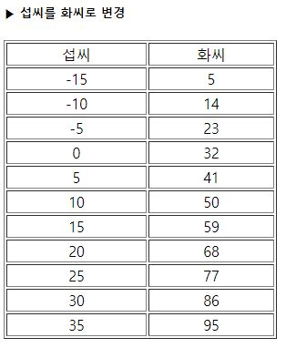

# 3-22. 표 형태로 출력한 c_to_f.php

source: `{{ page.path }}`

```php
<?
	$num=80;

	if($num%2==0) {
		echo "$num : 짝수";
	}
	else {
		echo "$num : 홀수";
	}
?>
```


결과 :
```
▶ 섭씨를 화씨로 변경
섭씨	화씨
-15	5
-10	14
-5	23
0	32
5	41
10	50
15	59
20	68
25	77
30	86
35	95
```


