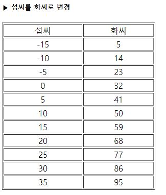

# 3-23. HTML 태그 위치를 이동한 c_to_f_table.php

source: `{{ page.path }}`

```php
<html>
<body>
	<h5>▶ 섭씨를 화씨로 변경</h5>
	<table border='1' width='300'>
		<tr align='center'><td width='150'>섭씨</td><td>화씨</td></tr>
		<?
			for($c=-15; $c<=35; $c=$c+5){
				$f=$c * 9/5 + 32;
				echo "<tr align='center'><td>$c</td><td>$f</td></tr>";
			}
		?>
	</table>
</body>
</html>
```


결과 :
```
▶ 섭씨를 화씨로 변경
섭씨	화씨
-15	5
-10	14
-5	23
0	32
5	41
10	50
15	59
20	68
25	77
30	86
35	95
```


