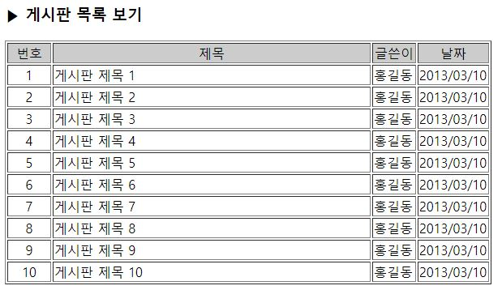

# 3-24. 게시판 목록 보기

source: `{{ page.path }}`

```php
<html>
<body>
	<h3>▶ 게시판 목록 보기</h3>
	<table border='1' width='600'>
		<tr bgcolor='#cccccc' align='center'><td>번호</td><td>제목</td><td>글쓴이</td><td>날짜</td></tr>
		<?
			$num=1;
			$name="홍길동";
			$date="2013/03/10";

			for($i=1; $i<=10; $i++){
				$title="게시판 제목 ".$num;
				echo ("<tr>
						<td width='50' align='center'>$num</td><td>$title</td>
						<td width='50'>$name</td><td width='80'>$date</td>
					</tr>");
				$num++;
			}
		?>
	</table>
</body>
</html>
```


결과 :
```
▶ 게시판 목록 보기
번호	제목	글쓴이	날짜
1	게시판 제목 1	홍길동	2013/03/10
2	게시판 제목 2	홍길동	2013/03/10
3	게시판 제목 3	홍길동	2013/03/10
4	게시판 제목 4	홍길동	2013/03/10
5	게시판 제목 5	홍길동	2013/03/10
6	게시판 제목 6	홍길동	2013/03/10
7	게시판 제목 7	홍길동	2013/03/10
8	게시판 제목 8	홍길동	2013/03/10
9	게시판 제목 9	홍길동	2013/03/10
10	게시판 제목 10	홍길동	2013/03/10
```


