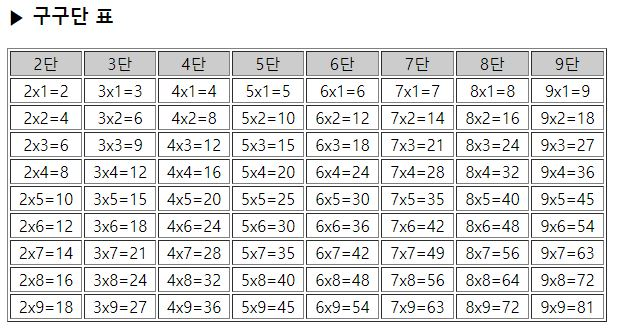

# 3-27. 구구단 표 출력

source: `{{ page.path }}`

```php
<html>
<body>
	<h3>▶ 구구단 표</h3>
	<table border='1' width='600'>
		<tr bgcolor='#cccccc' align='center'>
			<td>2단</td>
			<td>3단</td>
			<td>4단</td>
			<td>5단</td>
			<td>6단</td>
			<td>7단</td>
			<td>8단</td>
			<td>9단</td>
		</tr>
		<?
			for($b=1; $b<=9; $b++){
				echo "<tr align='center'>";

				for($a=2; $a<=9; $a++){
					$c=$a * $b;
					echo "<td>{$a}x{$b}=$c</td>";  // { } 빈 칸을 주기 싫을 때..
				}

				echo "</tr>";
			}
		?>
	</table>
</body>
</html>
```


결과 :
```
▶ 구구단 표
2단	3단	4단	5단	6단	7단	8단	9단
2x1=2	3x1=3	4x1=4	5x1=5	6x1=6	7x1=7	8x1=8	9x1=9
2x2=4	3x2=6	4x2=8	5x2=10	6x2=12	7x2=14	8x2=16	9x2=18
2x3=6	3x3=9	4x3=12	5x3=15	6x3=18	7x3=21	8x3=24	9x3=27
2x4=8	3x4=12	4x4=16	5x4=20	6x4=24	7x4=28	8x4=32	9x4=36
2x5=10	3x5=15	4x5=20	5x5=25	6x5=30	7x5=35	8x5=40	9x5=45
2x6=12	3x6=18	4x6=24	5x6=30	6x6=36	7x6=42	8x6=48	9x6=54
2x7=14	3x7=21	4x7=28	5x7=35	6x7=42	7x7=49	8x7=56	9x7=63
2x8=16	3x8=24	4x8=32	5x8=40	6x8=48	7x8=56	8x8=64	9x8=72
2x9=18	3x9=27	4x9=36	5x9=45	6x9=54	7x9=63	8x9=72	9x9=81
```


