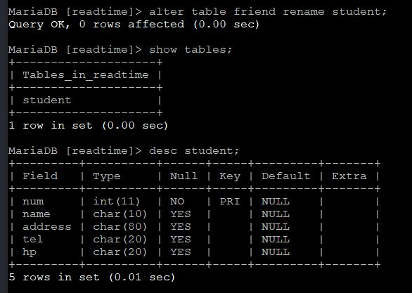

# 6-2. 데이터베이스 테이블 관련 명령

source: `{{ page.path }}`

| 명령                    | 기능                                 |
|-------------------------|-------------------------------------|
| create table            | 데이터베이스 테이블 생성              |
| show tables             | 데이터베이스 테이블 목록 확인         |
| desc                    | 데이터베이스 테이블 구조 확인         |
| alter table ~ add ~     | 데이터베이스 테이블에 새로운 필드 추가 |
| alter table ~ drop ~    | 데이터베이스 테이블의 특정 필드 삭제   |
| alter table ~ change ~  | 데이터베이스 테이블의 필드 변경        |
| alter table ~ modify ~  | 데이터베이스 테이블의 필드 타입 수정   |
| alter table ~ rename ~  | 데이터베이스 테이블명 변경            |
| drop table              | 데이터베이스 테이블 삭제              |


## 1. 데이터베이스 테이블 생성 명령

### 데이터 베이스 테이블 생성 명령

```bash
MariaDB [(none)]> show databases;
+--------------------+
| Database           |
+--------------------+
| information_schema |
| readtime           |
+--------------------+
2 rows in set (0.01 sec)

MariaDB [(none)]> use readtime;
Database changed
MariaDB [readtime]> show tables;
Empty set (0.00 sec)

MariaDB [readtime]> create table friend (
    -> num int not null,
    -> name char(10),
    -> address char(80),
    -> tel char(20),
    -> email char(20),
    -> primary key(num)
    -> );
Query OK, 0 rows affected (0.01 sec)

MariaDB [readtime]> show tables;
+--------------------+
| Tables_in_readtime |
+--------------------+
| friend             |
+--------------------+
1 row in set (0.00 sec)
```

### 데이터베이스 테이블 구조 확인

```bash
MariaDB [readtime]> desc friend;
+---------+----------+------+-----+---------+-------+
| Field   | Type     | Null | Key | Default | Extra |
+---------+----------+------+-----+---------+-------+
| num     | int(11)  | NO   | PRI | NULL    |       |
| name    | char(10) | YES  |     | NULL    |       |
| address | char(80) | YES  |     | NULL    |       |
| tel     | char(20) | YES  |     | NULL    |       |
| email   | char(20) | YES  |     | NULL    |       |
+---------+----------+------+-----+---------+-------+
5 rows in set (0.01 sec)
```

## 2. 데이터베이스 테이블 수정 명령

### 새로운 필드 추가 명령


### 필드 삭제 명령


### 필드 수정 명령


### 필드 타입 수정 명령


### 데이터베이스 테이블명 수정 명령




### 데이터베이스 테이블 삭제 명령


