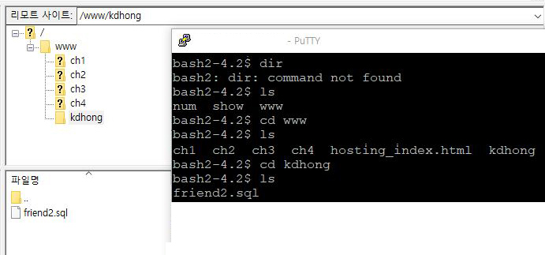
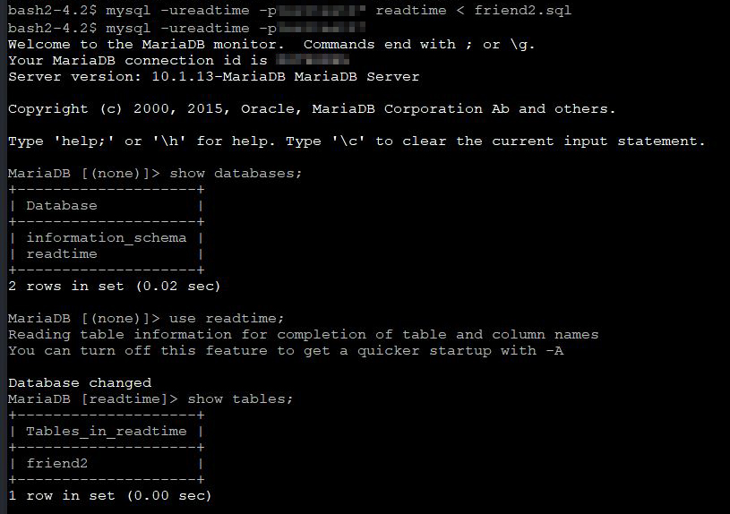
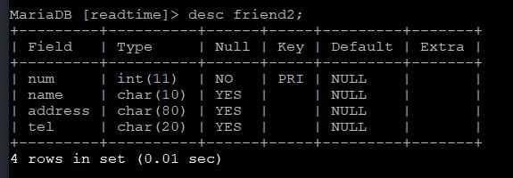

# 6-3. SQL 명령의 일괄 실행

source: `{{ page.path }}`

## 1. 텍스트 파일에 데이터베이스 테이블 생성 명령 저장  

메모장에서 작성해 friend2.sql 로 저장

```bash
create table friend2(
num int not null,
name char(10),
address char(80),
tel char(20),
primary key(num)
);
```

## 2. kdhong 폴더로 이동



## 3. SQL 명령 일괄 실행 및 실행 확인




