# 6-4. 레코드 관련 명령

source: `{{ page.path }}`

| 명령                            | 기능                           |
|---------------------------------|-------------------------------|
| insert into ~ values ~          | 레코드 삽입                    |
| select ~ from ~                 | 특정 필드에 해당하는 데이터 검색 |
| select ~ from ~ where ~         | 조건에 맞는 레코드 검색         |
| select ~ from ~ where ~ like ~  | 특정 문자열이 포함된 레코드 검색 |
| select ~ from ~ order by ~      | 오름차순으로 레코드 정렬        |
| select ~ from ~ order by ~ desc | 내림차순으로 레코드 정렬        |
| update ~ set ~ where ~          | 레코드 수정                    |
| delete from ~ where ~           | 레코드 삭제                    |


## 1. 레코드 삽입 명령: insert

```note
putty에서 한글 입력이 안 되어서, 7장에 php와 mysql연동 페이지에서 레코드 삽입함!
```

```bash
mysql> insert into friend2 (num, name, address, tel)
 -> values (1, '배성진', '서울 동작구 노량진동', '234-7693');
```

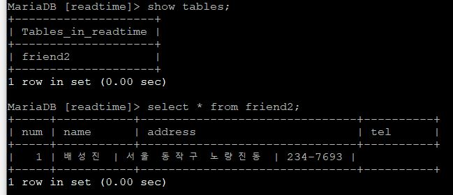

```bash
mysql> insert into friend2 values
 -> (2, '성지연', '대전시 유성구 송강동', '978-3875');
```

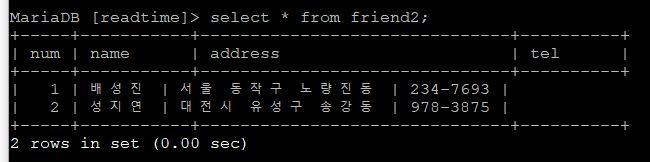

---

## 2. 데이터베이스 테이블 생성 및 다수의 레코드 삽입

**2-1. 데이터베이스 테이블 설계**

**2-2. mem.sql 일괄 실행** mem 데이터베이스 테이블 생성

```bash
create table mem (
num int not null,
id  char(15) not null,
name char(10) not null,
sex char(1),
post_num char(8),
address char(80),
tel char(20),
age int,
primary key(num)
);

insert into mem values (1, 'yjhwang', '황영주', 'M', '100-011', '서울시 중구 충무로1가', '234-8879', 35);
insert into mem values (2, 'khshul', '설기형', 'M', '607-010', '부산시 동래구 명륜동', '764-3784', 33);
insert into mem values (3, 'chpark', '박철호', 'M', '503-200', '광주시 남구 지석동', '298-9730', 34);
insert into mem values (4, 'shlee', '이상훈', 'M', '503-201', '광주시 남구 도금동', '838-4347', 32);
insert into mem values (5, 'jyjang', '장영숙', 'W', '606-065', '부산시 영도구 봉래동5가', '399-9809', 24);
insert into mem values (6, 'yjbae', '배용진', 'M', '122-014', '서울시 은평구 응암4동', '857-5683', 30);
insert into mem values (7, 'hbpark', '박혜빈', 'W', '427-760', '경기도 과천시 중앙동', '234-7677', 22);
insert into mem values (8, 'mskim', '김문수', 'M', '429-020', '경기도 시흥시 신천동', '370-6003', 63);
insert into mem values (9, 'bkcha', '차범길', 'M', '302-121', '대전시 서구 둔산1동', '432-9877', 49);
insert into mem values (10, 'kskim', '김길수', 'M', '440-747', '경기도 수원시 장안구 파장동', '324-5875', 54);
insert into mem values (11, 'srkim', '김수련', 'M', '704-701', '대구시 달서구 신당동', '987-3688', 23);
insert into mem values (12, 'shlee', '이성현', 'M', '441-081', '경기도 수원시 권선구 매산로1가', '243-6844', 36);
insert into mem values (13, 'hnjang', '정한나', 'W', '502-763', '광주시 서구 화정4동', '845-4547', 58);
insert into mem values (14, 'mylee', '이명연', 'W', '502-791', '광주시 서구 쌍촌동', '837-9432', 33);
insert into mem values (15, 'yskim', '김영숙', 'W', '429-010', '경기도 시흥시 대야동', '374-8438', 53);
insert into mem values (16, 'jekim', '김정은', 'W', '503-202', '광주시 남구 원산동', '347-8873', 29);
insert into mem values (17, 'yjko', '고영주', 'W', '122-020', '서울시 은평구 녹번동', '479-3874', 32);
insert into mem values (18, 'cyahn', '안철영', 'M', '122-030', '서울시 은평구 대조동', '347-4687', 34);
insert into mem values (19, 'jmkim', '김진모', 'M', '530-140', '전라남도 목포시 항동', '379-8349', 28);
insert into mem values (20, 'ycshul', '설영찬', 'M', '606-070', '부산시 영도구 청학동', '983-8748', 41);
insert into mem values (21, 'jjko', '고재진', 'M', '100-013', '서울시 중구 충무로3가', '836-4655', 28);
insert into mem values (22, 'hwlee', '이현우', 'M', '606-071', '부산시 영도구 청학1동', '346-8892', 32);
insert into mem values (23, 'cskang', '강찬숙', 'W', '668-890', '경상남도 남해군 설천면', '377-6879', 21);
insert into mem values (24, 'ypji', '지영필', 'M', '122-040', '서울시 은평구 불광동',  '366-3747', 52);
insert into mem values (25, 'jbkim', '김진배', 'M', '427-600', '경기도 과천시 과천동', '382-4993', 47);
insert into mem values (26, 'jepark', '박지은', 'W', '670-800', '경상남도 거창군 거창읍', '328-8743', 26);
insert into mem values (27, 'jhlee', '이지현', 'W', '704-702', '대구시 달서구 월성동', '386-7988', 27);
insert into mem values (28, 'bykang', '강부영', 'M', '302-120', '대전시 서구 둔산동', '798-3243', 62);
insert into mem values (29, 'jymoon', '문진영', 'W', '302-122', '대전시 서구 둔산2동', '987-3248', 18);
insert into mem values (30, 'jyjun', '전지연', 'W', '100-012' , '서울시 중구 충무로2가', '347-2236', 28);
insert into mem values (31, 'jkko', '고진길', 'M', '122-013', '서울시 은평구 응암3동', '234-7466', 27);
insert into mem values (32, 'myjung', '정명윤', 'M', '502-771', '광주시 서구 치평동', '374-8786', 47);
insert into mem values (33, 'jsyou', '유지수', 'W', '502-772', '광주시 서구 치평동', '309-3897', 49);
insert into mem values (34, 'dsshin', '신달성', 'W', '530-145', '전라남도 신안군 장산면', '399-8789', 53);
insert into mem values (35, 'sjshin', '신수진', 'W', '606-796', '부산시 영도구 봉래동5가', '389-8930', 47);
```

**2-3. 생성된 데이터베이스 테이블 및 테이블 구조 확인**

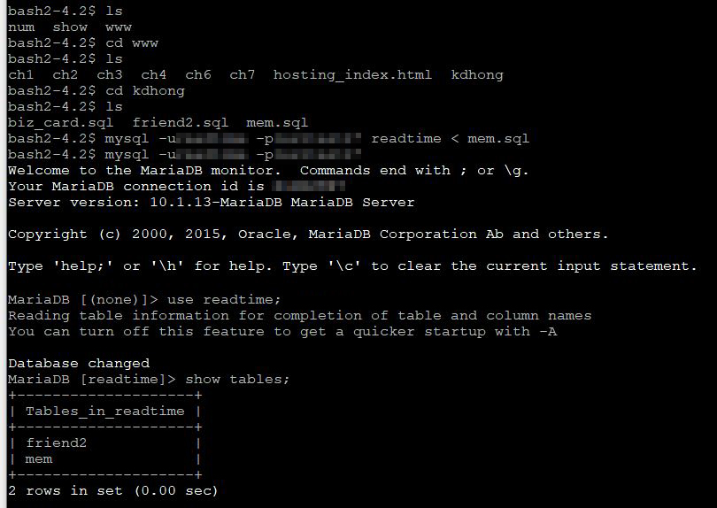

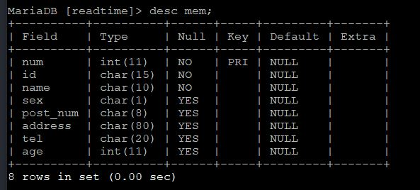

**4. 데이터베이스 mem에 저장된 레코드 확인**

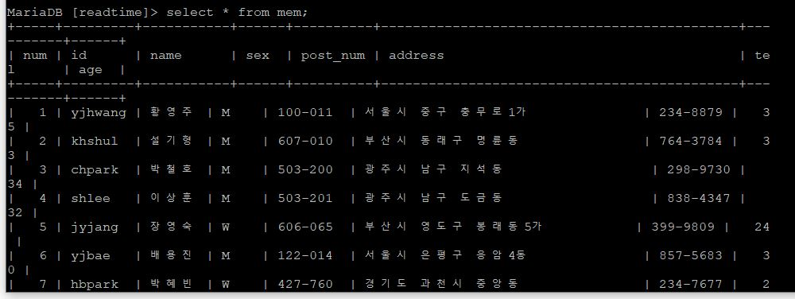

---

## 3. 레코드 검색 명령: select

### 3-1. 특정 필드 데이터 검색 명령

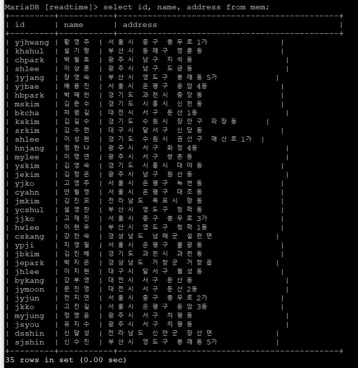

### 3-2. 전체 필드 데이터 검색 명령


### 3-3. 조건에 맞는 레코드 검색 명령

예제) 여성의 아이디, 이름, 주소, 전화번호, 성별 보기

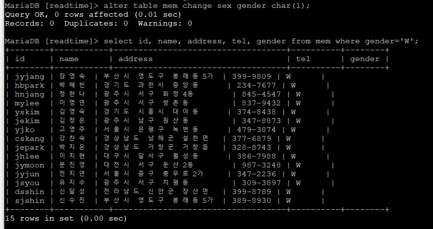

예제) 50세 이상인 레코드의 전체 필드 보기

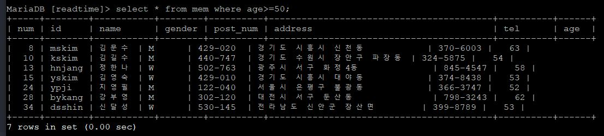

예제) 20대의 이름, 아이디, 주소, 우편번호, 나이 보기

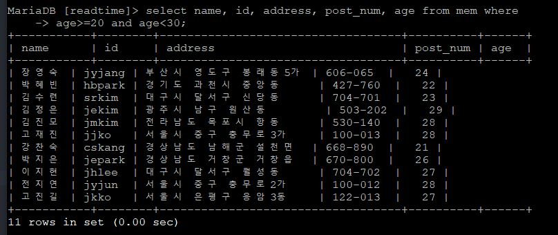

예제) 김진모 레코드의 아이디, 주소, 우편번호, 나이 출력

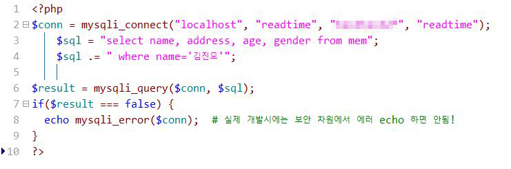

예제) 40대 남성의 이름, 주소, 나이, 성별 보기

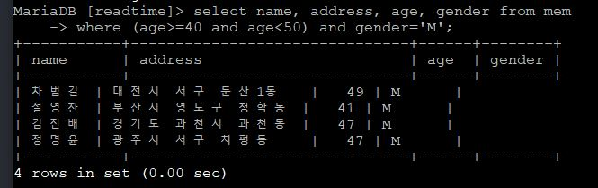

예제) 20대 또는 40대 여성의 이름, 아이디, 주소, 전화번호, 나이, 성별 보기

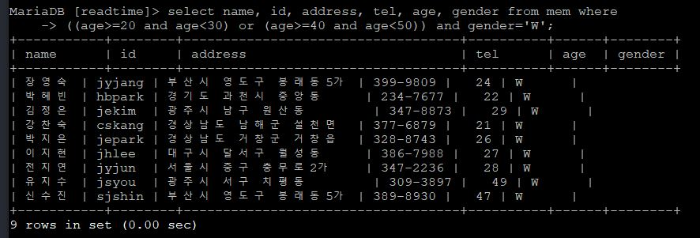

---

### 3-4. 특정 문자열이 포함된 레코드 검색 명령

% : 임의의 여러 글자  

예제) 성이 '김'인 사람의 이름, 주소, 전화번호 보기

```mysql
mysql> select name, address, tel from mem where name like '김%';
```

예제) 서울에 사는 사람의 이름, 주소 보기

```mysql
mysql> select name, address from mem where address like '서울%';
```

예제) 부산에 사는 여성의 이름, 주소, 성별 보기

```mysql
mysql> select name, address from mem
-> where address like '부산%' and gender='W';
```

예제) 가운데 글자가 '용'인 사람의 이름, 아이디 보기

```mysql
mysql> select name, id address from mem where name like '__용%';
```

예제) 광주에 사는 성이 '김'인 사람의 이름, 주소, 전화번호 보기

```mysql
mysql> select name, address, tel from mem
-> where address like '광주%' and name like '김%';
```

---

## 4. 레코드 정렬 명령: order by

### 4-1. 오름차순 정렬 명령

예제) 나이순 오름차순하고 age, id, name, gender, tel 필드 데이터만 출력

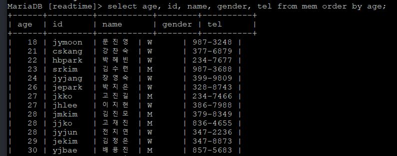

### 4-2. 내림차순 정렬 명령

예제) 내림차순으로 정렬

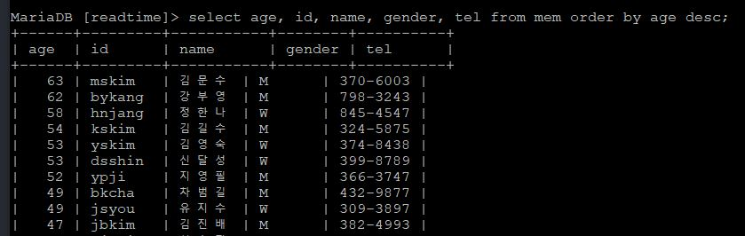

예제) mem 테이블에서 서울에 사는 사람들을 나이가 많은 순서로 정렬하고 age, name, address에 해당하는 데이터를 나열

```mysql
mysql> select age, name, address from mem where address like '서울%'
-> order by age desc;
```

```note
한글 문자열 정렬

이름순으로 레코드를 정렬하면 정렬이 잘 안되는 현상은 한글의 '가나다...' 순서가 이진 한글 레코드의 순서와 일치하지 않기 때문에 발생한다.
MySQL 프로그램을 설치할 때 한글이 제대로 적용되도록 해당 파라미터를 옵션으로 설정해줘야 한다.
```

---

## 5. 레코드 수정 명령: update

예제) 전화번호 수정

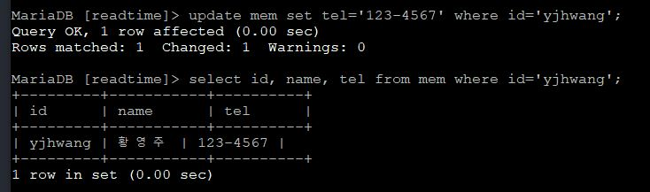


예제) 나이 수정

```mysql
mysql> select name, age from mem where name='신수진';

+---------+---------+
| name    | age     |
+---------+---------+
| 신수진   |      47 |
+---------+---------+
```

```mysql
mysql> update mem set age=27 where name='신수진';
mysql> select name, age from mem where name='신수진';

+---------+---------+
| name    | age     |
+---------+---------+
| 신수진   |      27 |
+---------+---------+
```

---

## 6. 레코드 삭제 명령: delete from

### 6-1. 특정 레코드 삭제

예제) 김길수 레코드 삭제

```mysql
mysql> delete from mem where name='김길수';
Query OK, 1 row affected <0.00 sec>

mysql> select * from mem where name='김길수';
Empty set <0.00 sec>
```

예제) 30~50세 레코드 삭제

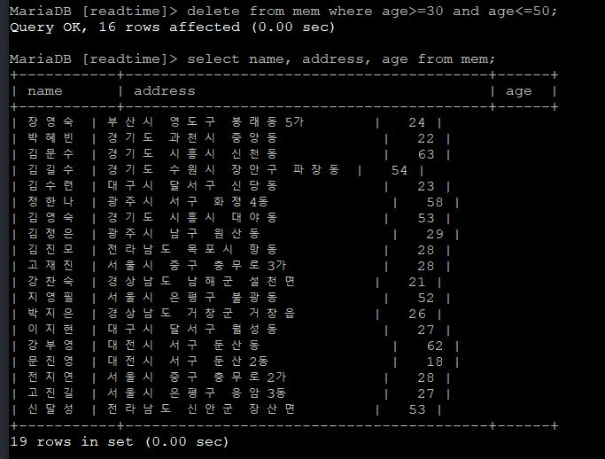

### 6-2. 전체 레코드 삭제

```mysql
mysql> delete from mem;
```
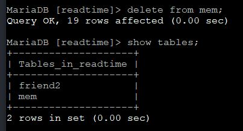
