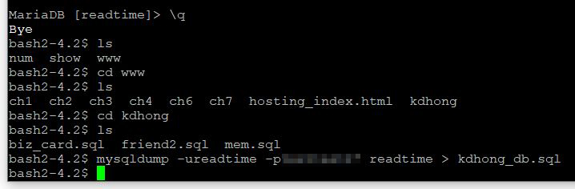
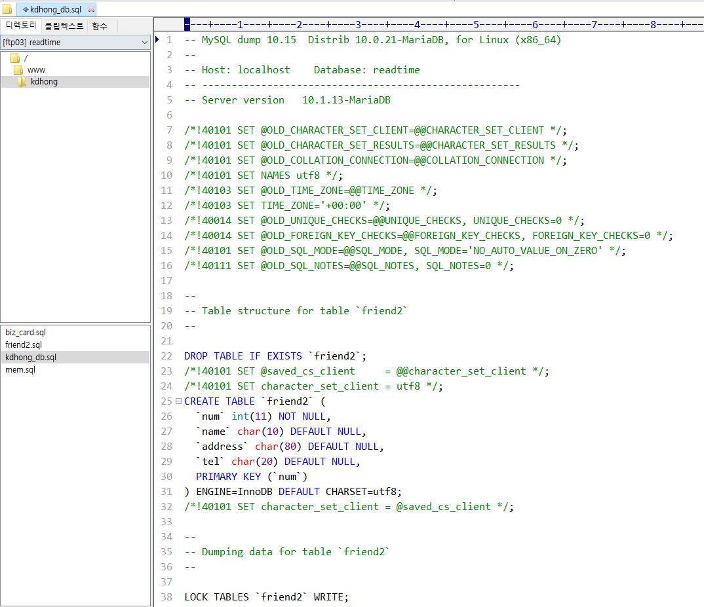

# 6-5. 데이터베이스 백업 및 복원 명령

source: `{{ page.path }}`

**데이터베이스 백업**

```bash
mysqldump -u계정 -p비밀번호 데이터베이스명 > 백업 파일명
```



[C:\kdhong] 폴더에 백업 파일이 저장되는데, 다른 폴더에서 백업 명령을 수행해도 상관없다.



---

**데이터베이스 복원**

```bash
mysql -u계정 -p비밀번호 데이터베이스명 < 백업 파일명
```

[C:\kdhong] 폴더에 백업 파일인 kdhong_db.sql이 있어야 한다.  
더블어 접속 가능한 다른 계정(kim)과 데이터베이스(kim_db)도 백업 명령을 실행하기 전에 이미 존재해야 한다.
