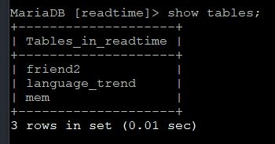
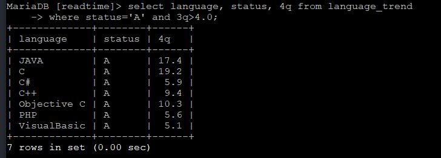

# 6-6. SQL 명령 추가 실습

source: `{{ page.path }}`

## 1. 일반

예제) 일괄 실행으로 데이터베이스 테이블 생성하고 레코드 삽입하시오.

예제) 데이터베이스 테이블의 존재를 확인하시오.

예제) 레코드의 존재를 확인하시오.

---

## 2. 검색 명령_ 조건에 맞는 레코드 검색

예제) 4분기 점유율이 1% 이상인 언어의 이름과 4분기 점유율을 출력하시오.

예제) 1분기에 비해 4분기에 점유율이 상승한 언어의 이름, 1분기 점유율, 4분기 점유율을 출력하시오.

예제) 평가 등급이 A인 언어 중 3분기 점유율이 4% 이상인 언어의 이름, 평가 등급, 4분기 점유율을 출력하시오.

예제) 평가 등급이 B인 언어는?

예제) PHP 레코드의 값을 화면에 출력하시오.

예제) 평가 등급이 A이고 3분기 점유율이 4% 이상인 언어는?

---

## 3. 검색 명령_ 특정 문자열이 포함된 레코드 검색 명령

예제) 프로그래밍 언어 중 이름에 C가 들어가는 언어는?

예제) 프로그래밍 언어 중 이름이 SQL로 끝나는 언어는?

예제) 프로그래밍 언어 중 이름이 J로 시작하는 언어는?

---

## 4. 검색 명령_ 레코드 정렬 명령

예제) 4분기 점유율이 높은 순서대로 출력하시오.

예제) 작년 순위가 높은 순서대로 출력하시오.

예제) 평가 등급이 A인 언어 중 2분기 점유율이 낮은 순서대로 출력하시오.

예제) 3분기와 4분기 점유율이 5% 이상인 언어를 알파벳 순으로 출력하시오.

---

## 5.레코드 수정 명령

예제) 평가 등급이 A인 언어 중 3분기 점유율이 1%가 안 되는 언어의 평가 등급을 B로 수정하시오.

예제) Fortran의 4분기 점유율을 0.5%로 수정하시오.

예제) PHP의 3분기 점유율을 7%, 4분기 점유율을 9%로 수정하시오.

예제) Peal의 2분기와 4분기 점유율을 각각 1.2%, 1.3%로 수정하고, 평가 등급을 B로 수정하시오.

---

## 6.레코드 삭제 명령

예제) JavaScript의 레코드를 삭제하시오.

예제) 평가 등급이 B인 언어의 레코드를 삭제하시오.

예제) V로 시작하는 언어의 레코드를 삭제하시오.

예제) 1/2/3/4분기 점유율이 모두 1% 이하인 레코드를 삭제하시오.

