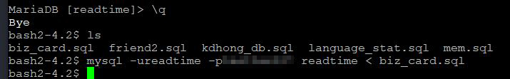
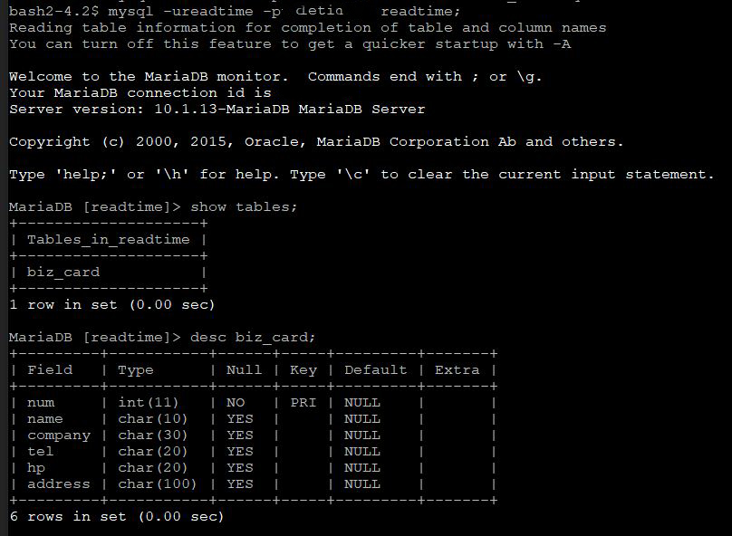
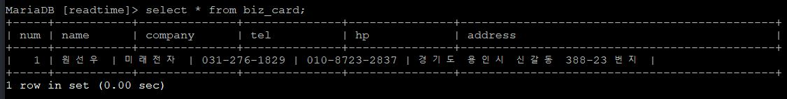

# 7-1. MySQL을 지원하는 PHP API 함수

source: `{{ page.path }}`

## 데이터베이스 테이블 생성과 레코드 삽입

### 명령 프롬프트에서 데이터베이스 테이블 생성

biz_card.sql 데이터베이스 테이블 생성 및 일괄 실행

```bash
create table biz_card (
num int,
name char(10),
company char(30),
tel char(20),
hp char(20),
address char(100),
primary key(num)
);
```



테이블 존재와 구조 확인



### PHP API 함수를 이용한 레코드 삽입

```php
<?
	$conn = mysqli_connect("localhost", "readtime", "********", "readtime");

	$sql = "insert into biz_card (num, name, company, tel, hp, address)";
	$sql .= " values (1, '원선우', '미래전자', '031-276-1829', ";
	$sql .= " '010-8723-2837', '경기도 용인시 신갈동 388-23 번지')";

	$result = mysqli_query($conn, $sql);
	if($result)
		echo "레코드 삽입 완료!";
	else
		echo "레코드 삽입 실패! 에러 확인 요망!";

	mysqli_close();
?>
```

결과 :
```
레코드 삽입 완료!
```


