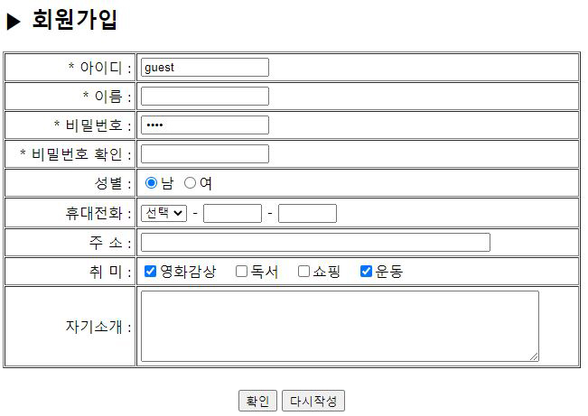
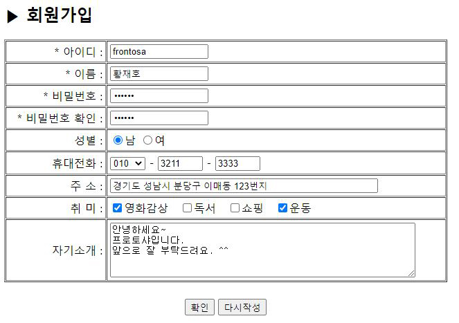
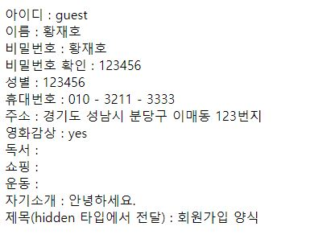

# 7-2. <form>과 변수값 전달

source: `{{ page.path }}`

## 1. 회원가입 페이지 생성

mem_form.php
```php
<html>
<head>
<meta charset="UTF-8">
</head>
<body>
	<h2>▶ 회원가입</h2>
	<form name="mem_form" method="post" action="mem_print.php">
		<input type="hidden" name="title" value="회원가입 양식">
		<table border="1" width="640" cellspacing="1" cellpadding="4">
			<tr>
				<td align="right">* 아이디 :</td>
				<td><input type="text" size="15" maxlength="12" name="id" value="guest"></td>
			</tr>
			<tr>
				<td align="right"> * 이름 :</td>
				<td><input type="text" size="15" maxlength="12" name="name"></td>
			</tr>
			<tr>
				<td align="right"> * 비밀번호 :</td>
				<td><input type="password" size="15" maxlength="10" name="passwd" value="1234"></td>
			</tr>
			<tr>
				<td align="right"> * 비밀번호 확인 :</td>
				<td><input type="password" size="15" maxlength="10" name="passwd_confirm"></td>
			</tr>
			<tr>
				<td align="right">성별 :</td>
				<td>
					<input type="radio" name="gender" value="M" checked>남
					<input type="radio" name="gender" value="F">여
				</td>
			</tr>
			<tr>
				<td align="right">휴대전화 :</td>
				<td>
					<select name="phone1">
						<option>선택</option>
						<option value="010">010</option>
						<option value="011">011</option>
						<option value="017">017</option>
					</select> -
					<input type="text" size="4" name="phone2" maxlength="4"> -
					<input type="text" size="4" name="phone3" maxlength="4">
				</td>
			</tr>
			<tr>
				<td align="right">주 소 :</td>
				<td><input type="text" size="50" name="address"></td>
			</tr>
			<tr>
				<td align="right">취 미 :</td>
				<td>
					<input type="checkbox" name="movie" value="yes" checked>영화감상 &nbsp;
					<input type="checkbox" name="book" value="yes" >독서 &nbsp;
					<input type="checkbox" name="shop" value="yes" >쇼핑 &nbsp;
					<input type="checkbox" name="sport" value="yes" checked>운동 &nbsp;
				</td>
			</tr>
			<tr>
				<td align="right">자기소개 :</td>
				<td><textarea name="intro" rows="5" cols="60"></textarea></td>
			</tr>
		</table>
		<br>
		<table border="0" width="640">
			<tr>
				<td align="center">
					<input type="submit" value="확인">
					<input type="reset" value="다시작성">
				</td>
			</tr>
		</table>
	</form>
</body>
</html>
```



## 2. 회원정보 확인

mem_print.php

```note
register_globals가 Off인 경우 (ch8-3 참고)

php.ini에서 register_globals를 Off으로 설정했다면 POST 변수값 전달 방식에서 사용한  
$_POST[변수명]와 유사하게 $_COOKIE[쿠키의 이름]을 사용해야 한다.
```

```
<?
	$id = $_POST[id];
	$name = $_POST[name];
	$passwd = $_POST[passwd];
	$passwd_confirm = $_POST[passwd_confirm];
	$phone1 = $_POST[phone1];
	$phone2 = $_POST[phone2];
	$phone3 = $_POST[phone3];
	$address = $_POST[address];
	$movie = $_POST[movie];
	$book = $_POST[book];
	$shop = $_POST[shop];
	$intro = $_POST[intro];
	$title = $_POST[title];

	echo "아이디 : $id<br>";
	echo "이름 : ".$_POST['name']."<br>";
	echo "비밀번호 : $passwd<br>";
	echo "비밀번호 확인 : $passwd_confirm<br>";
	echo "성별 : $passwd_confirm<br>";
	echo "휴대번호 : $phone1 - $phone2 - $phone3<br>";
	echo "주소 : $address<br>";
	echo "영화감상 : $movie<br>";
	echo "독서 : $book<br>";
	echo "쇼핑 : $shop<br>";
	echo "운동 : $sport<br>";
	echo "자기소개 : $intro<br>";
	echo "제목(hidden 타입에서 전달) : $title<br>";
?>
```




