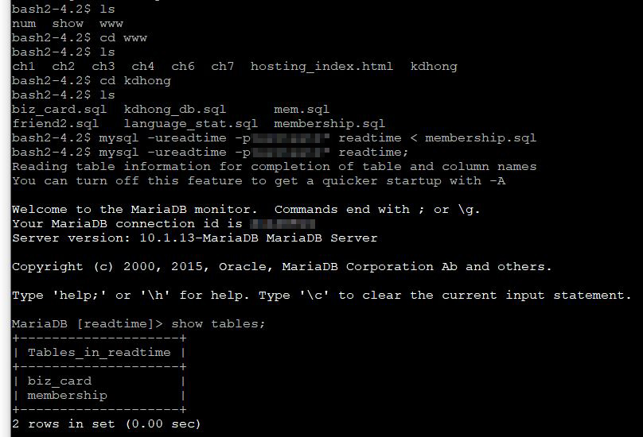
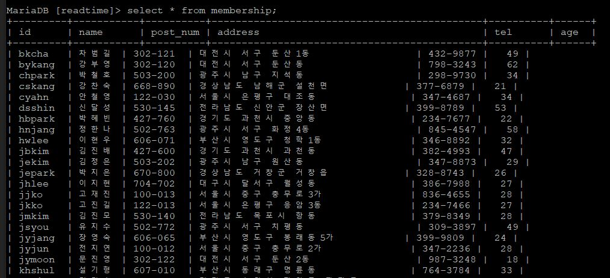
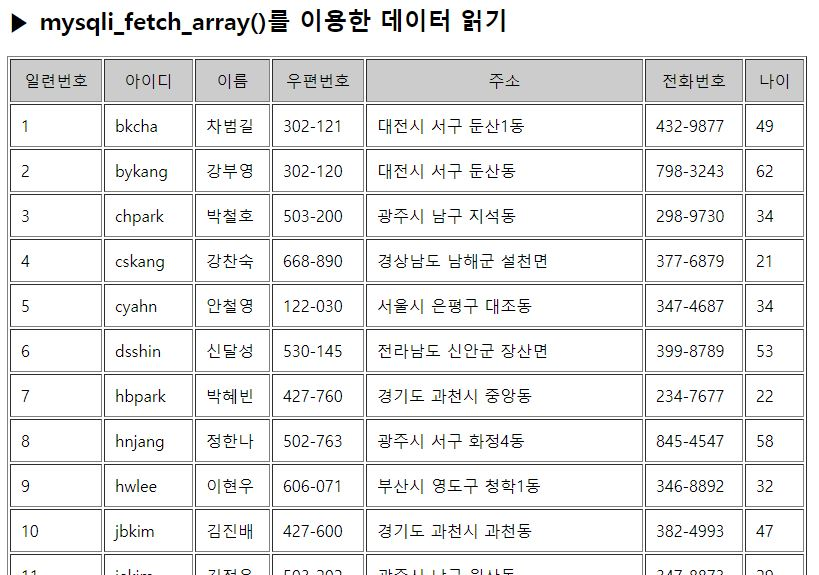
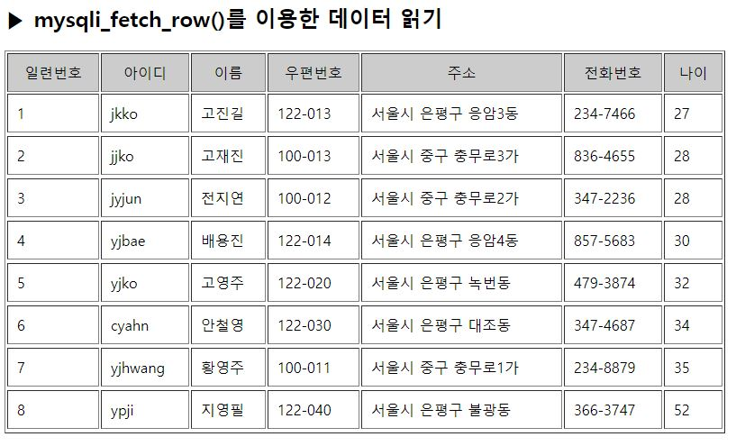

# 7-3. 데이터베이스 테이블 생성과 데이터 읽기

source: `{{ page.path }}`

## 1. 데이터베이스 테이블 생성과 레코드 삽입

membership.sql 일괄 실행
```bash
create table membership (
id  varchar(10) not null,
name varchar(10) not null,
post_num char(8),
address varchar(80),
tel varchar(20),
age int,
primary key(id)
);

insert into membership values ('yjhwang', '황영주', '100-011', '서울시 중구 충무로1가', '234-8879', 35);
insert into membership values ('khshul', '설기형', '607-010', '부산시 동래구 명륜동', '764-3784', 33);
insert into membership values ('chpark', '박철호', '503-200', '광주시 남구 지석동', '298-9730', 34);
insert into membership values ('shlee', '이상훈', '503-201', '광주시 남구 도금동', '838-4347', 32);
insert into membership values ('jyjang', '장영숙', '606-065', '부산시 영도구 봉래동5가', '399-9809', 24);
insert into membership values ('yjbae', '배용진', '122-014', '서울시 은평구 응암4동', '857-5683', 30);
insert into membership values ('hbpark', '박혜빈', '427-760', '경기도 과천시 중앙동', '234-7677', 22);
insert into membership values ('mskim', '김문수', '429-020', '경기도 시흥시 신천동', '370-6003', 63);
insert into membership values ('bkcha', '차범길', '302-121', '대전시 서구 둔산1동', '432-9877', 49);
insert into membership values ('kskim', '김길수', '440-747', '경기도 수원시 장안구 파장동', '324-5875', 54);
insert into membership values ('srkim', '김수련', '704-701', '대구시 달서구 신당동', '987-3688', 23);
insert into membership values ('sunglee', '이성현', '441-081', '경기도 수원시 권선구 매산로1가', '243-6844', 36);
insert into membership values ('hnjang', '정한나','502-763', '광주시 서구 화정4동', '845-4547', 58);
insert into membership values ('mylee', '이명연', '502-791', '광주시 서구 쌍촌동', '837-9432', 33);
insert into membership values ('yskim', '김영숙', '429-010', '경기도 시흥시 대야동', '374-8438', 53);
insert into membership values ('jekim', '김정은', '503-202', '광주시 남구 원산동', '347-8873', 29);
insert into membership values ('yjko', '고영주', '122-020', '서울시 은평구 녹번동', '479-3874', 32);
insert into membership values ('cyahn', '안철영', '122-030', '서울시 은평구 대조동', '347-4687', 34);
insert into membership values ('jmkim', '김진모', '530-140', '전라남도 목포시 항동', '379-8349', 28);
insert into membership values ('ycshul', '설영찬', '606-070', '부산시 영도구 청학동', '983-8748', 41);
insert into membership values ('jjko', '고재진', '100-013', '서울시 중구 충무로3가', '836-4655', 28);
insert into membership values ('hwlee', '이현우', '606-071', '부산시 영도구 청학1동', '346-8892', 32);
insert into membership values ('cskang', '강찬숙', '668-890', '경상남도 남해군 설천면', '377-6879', 21);
insert into membership values ('ypji', '지영필', '122-040', '서울시 은평구 불광동',  '366-3747', 52);
insert into membership values ('jbkim', '김진배', '427-600', '경기도 과천시 과천동', '382-4993', 47);
insert into membership values ('jepark', '박지은', '670-800', '경상남도 거창군 거창읍', '328-8743', 26);
insert into membership values ('jhlee', '이지현', '704-702', '대구시 달서구 월성동', '386-7988', 27);
insert into membership values ('bykang', '강부영', '302-120', '대전시 서구 둔산동', '798-3243', 62);
insert into membership values ('jymoon', '문진영', '302-122', '대전시 서구 둔산2동', '987-3248', 18);
insert into membership values ('jyjun', '전지연', '100-012' , '서울시 중구 충무로2가', '347-2236', 28);
insert into membership values ('jkko', '고진길', '122-013', '서울시 은평구 응암3동', '234-7466', 27);
insert into membership values ('myjung', '정명윤', '502-771', '광주시 서구 치평동', '374-8786', 47);
insert into membership values ('jsyou', '유지수', '502-772', '광주시 서구 치평동', '309-3897', 49);
insert into membership values ('dsshin', '신달성', '530-145', '전라남도 신안군 장산면', '399-8789', 53);
insert into membership values ('sjshin', '신수진', '606-796', '부산시 영도구 봉래동5가', '389-8930', 47);
```

테이블 확인



레코드 확인



## 2. PHP API 함수를 이용해 데이터 읽기

### 2-1. mysqli_fetch_array()함수를 이용한 레코드 가져오기

```php
<?
	$conn = mysqli_connect("localhost", "readtime", "********", "readtime");

	$sql = "select * from membership;";
	$result = mysqli_query($conn, $sql);

	$number=1;
?>
<h2>▶ mysqli_fetch_array()를 이용한 데이터 읽기</h2>
<table width= "800" border="1" cellpadding="10">
	<tr align="center">
		<td bgcolor="#cccccc">일련번호</td>
		<td bgcolor="#cccccc">아이디</td>
		<td bgcolor="#cccccc">이름</td>
		<td bgcolor="#cccccc">우편번호</td>
		<td bgcolor="#cccccc">주소</td>
		<td bgcolor="#cccccc">전화번호</td>
		<td bgcolor="#cccccc">나이</td>
	</tr>
	<?
	 while ($row = mysqli_fetch_array($result))
	 {
		echo "
		<tr>
			<td> $number </td>
			<td> $row[id] </td>
			<td> $row[name] </td>
			<td> $row[post_num] </td>
			<td> $row[address] </td>
			<td> $row[tel] </td>
			<td> $row[age] </td>
		</tr>
		";
		$number++;
	 }

	 mysqli_close();
	?>
</table>
```



### 2-2. mysqli_fetch_row() 함수를 이용한 레코드 가져오기

```php
<?
	$conn = mysqli_connect("localhost", "readtime", "********", "readtime");

	$sql = "select * from membership where address like '%서울%' order by age;";
	$result = mysqli_query($conn, $sql);

	$fields = mysqli_num_fields($result);
	$number = 1;
?>
<h2>▶ mysqli_fetch_row()를 이용한 데이터 읽기</h2>
<table width= "800" border="1" cellpadding="10">
	<tr align="center">
		<td bgcolor="#cccccc">일련번호</td>
		<td bgcolor="#cccccc">아이디</td>
		<td bgcolor="#cccccc">이름</td>
		<td bgcolor="#cccccc">우편번호</td>
		<td bgcolor="#cccccc">주소</td>
		<td bgcolor="#cccccc">전화번호</td>
		<td bgcolor="#cccccc">나이</td>
	</tr>
	<?
	 while ($row = mysqli_fetch_row($result))
	 {
		echo "<tr>";
		echo "<td> $number </td>";

		for($i=0; $i<$fields; $i++) {
			echo "<td> $row[$i] </td>";
		}

		echo "<tr>";

		$number++;
	 }

	 mysqli_close();
	?>
</table>
```



### 2-3. mysqli_result() 함수를 이용한 레코드 가져오기

위에 결과에 똑같아야 하는데, 제대로 안 나옴;;

```php
<?
	$conn = mysqli_connect("localhost", "readtime", "********", "readtime");

	$sql = "select * from membership where address like '%서울%' order by age;";
	$result = mysqli_query($conn, $sql);

	$records = mysqli_num_rows($result);
	$fields = mysqli_num_fields($result);
	$number = 1;
?>
<h2>▶ mysqli_result()를 이용한 데이터 읽기</h2>
<table width= "800" border="1" cellpadding="10">
	<tr align="center">
		<td bgcolor="#cccccc">일련번호</td>
		<td bgcolor="#cccccc">아이디</td>
		<td bgcolor="#cccccc">이름</td>
		<td bgcolor="#cccccc">우편번호</td>
		<td bgcolor="#cccccc">주소</td>
		<td bgcolor="#cccccc">전화번호</td>
		<td bgcolor="#cccccc">나이</td>
	</tr>
	<?
	  for($i=0; $i<$records; $i++) {
			echo "<tr>";
			echo "<td> $number </td>";

			for($j=0; $j<$fields; $j++) {
				$data = mysqli_result($result, $i, $j);
				echo "<td> $data </td>";
			}
			echo "</tr>";
			$number++;
	  }

		mysqli_close();
	?>
</table>
```
