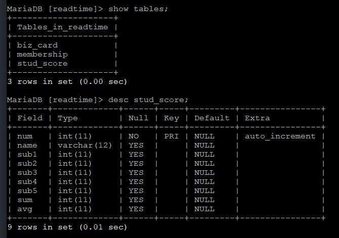

# 7-4. 성적 관리 프로그램 제작

source: `{{ page.path }}`

## 1. PHP에서 데이터베이스 테이블

stud_score.php
```
<?
	$conn = mysqli_connect("localhost", "readtime", "********", "readtime");

	$sql = "create table stud_score ( ";
	$sql .= "num int not null auto_increment, ";
	$sql .= "name varchar(12), ";
	$sql .= "sub1 int, ";
	$sql .= "sub2 int, ";
	$sql .= "sub3 int, ";
	$sql .= "sub4 int, ";
	$sql .= "sub5 int, ";
	$sql .= "sum int, ";
	$sql .= "avg int, ";
	$sql .= "primary key(num) )";

	$result = mysqli_query($conn, $sql);

	if($result)
		echo "데이터베이스 테이블 'stud_score'가 생성되었습니다!";
	else
		echo "데이터베이스 테이블 생성 에러!!!";

	mysqli_close();
?>
```

결과 :
```
데이터베이스 테이블 'stud_score'가 생성되었습니다!
```



## 2. 성적 관리 프로그램 작성

제대로 결과 안 나옴  (담에 다시 시도)
