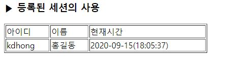
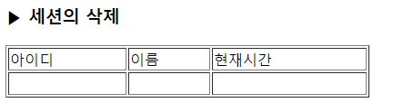

# 8-2. 세션

source: `{{ page.path }}`

## 1. 세션의 개요

세션(Session)? 쿠키와 유사한 개념이지만, 쿠키는 정보를 사용자 컴퓨터에 저장하는 반면에  
세션은 정보를 사용자 컴퓨터와 서버 양쪽에 나누어 저장한다.  
웹 사이트를 방문하는 사용자 컴퓨터에 세션 ID(SID, Session ID) 정보를 저장하고,  
서버에는 사용자 컴퓨터의 세션 ID에 대응하는 정보를 저장한다.

그리고 두 정보가 서로 짝이 맞아야 서버에서 데이터를 처리할 수 있다.  
따라서 사용자 컴퓨터의 세션 아이디가 유츌되더라도, 세션 아이디 자체에는 별다를 정보가 없고  
주요 정보는 서버에 저장되기 때문에 쿠키보다 안전하다.


|               | 서버  | 클라이언트 |  비교                        |
|---------------|-------|-----------|-----------------------------|
| 데이터 위치    | O     |           |                             |
| 세션정보       | O     | O         | 서로 대응되는 정보. 같지 않음 |
| 데이터 가공    | O     |           |                             |

---

## 2. 세션 시작과 등록

session1.php
```
<?
	session_start();

	echo "세션 시작!!!<p>";

	$_SESSION['userid'] = "kdhong";
	$_SESSION['username'] = "홍길동";
	$_SESSION['time'] = time();		// time()은 현재 시작

	echo "세 개의 세션 변수 등록 완료!!!<br>";
	echo $_SESSION['userid']."<br>";
	echo $_SESSION['username']."<br>";
	echo $_SESSION['time']."<br>";
?>
```

결과 :
```
세션 시작!!!
세 개의 세션 변수 등록 완료!!!
kdhong
홍길동
1600160737
```

---

## 3. 세션 사용 방법

### 3-1. register_globals가 On인 경우

session2.php
```
<?
	session_start();

	$time = date('Y-m-d(H:i:s)', $time);
?>
<html>
<head>
	<meta charset="UTF-8">
</head>
<body>
	<h3>▶ 등록된 세션의 사용</h3>
	<table width="400" border="1">
		<tr>
			<td>아이디</td><td>이름</td><td>현재시간</td>
		</tr>
		<tr>
			<td><?=$userid ?></td>
			<td><?=$username ?></td>
			<td><?=$time ?></td>
		</tr>
	</table>
</body>
</html>
```

결과 :
```
Not Found
The requested URL /ch8/session2.php was not found on this server.
```

```note
<?=$userid ?> = <? echo $userid ?>
```

---

### 3-2. register_globals가 Off인 경우

php.ini에서 register_globals를 Off으로 설정했다면 POST 변수값 전달 방식에서 사용한  
$_POST[변수명]와 유사하게 $_COOKIE[쿠키의 이름]을 사용해야 한다.

session3.php
```
<?
	session_start();

	$id = $_SESSION['userid'];
	$name = $_SESSION['username'];
	$time = $_SESSION['time'];

	$time = date('Y-m-d(H:i:s)', $time);
?>
<html>
<head>
	<meta charset="UTF-8">
</head>
<body>
	<h3>▶ 등록된 세션의 사용</h3>
	<table width="400" border="1">
		<tr>
			<td>아이디</td><td>이름</td><td>현재시간</td>
		</tr>
		<tr>
			<td><?=$id ?></td>
			<td><?=$name ?></td>
			<td><?=$time ?></td>
		</tr>
	</table>
</body>
</html>
```




---

## 4. 세션 삭제

delete_session.php
```
<?
	session_start();

	unset($_SESSION['userid']);
	unset($_SESSION['username']);
	unset($_SESSION['time']);

	$time = date('Y-m-d(H:i:s)', $time);
?>
<html>
<head>
	<meta charset="UTF-8">
</head>
<body>
	<h3>▶ 세션의 삭제</h3>
	<table width="400" border="1">
		<tr>
			<td>아이디</td><td>이름</td><td>현재시간</td>
		</tr>
		<tr>
			<td><?=$_SESSION['userid'] ?> &nbsp;</td>
			<td><?=$_SESSION['username'] ?> &nbsp;</td>
			<td><?=$_SESSION['time'] ?> &nbsp;</td>
		</tr>
	</table>
</body>
</html>
```


